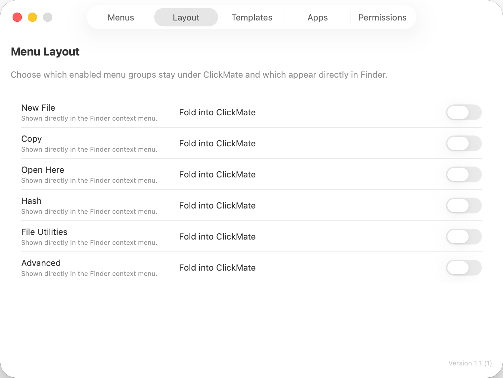
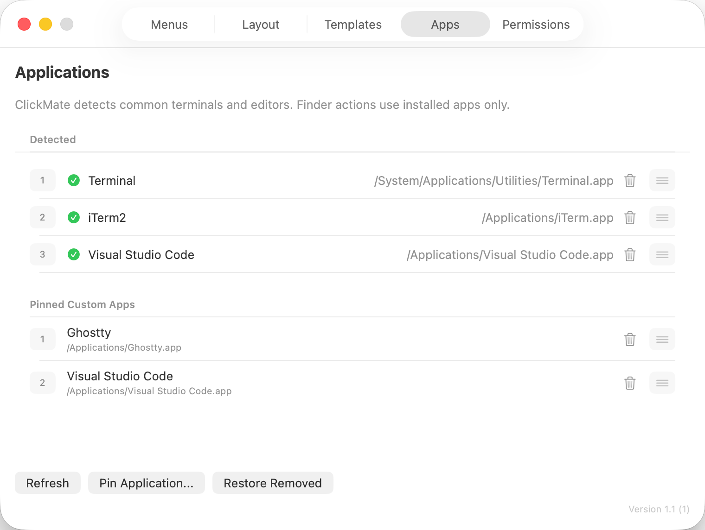

# ClickMate

[中文文档](README.zh-CN.md)

ClickMate is a native macOS Finder context-menu enhancer built with SwiftUI, AppKit, and a Finder Sync extension. It adds a configurable `ClickMate` submenu to Finder so common file and folder actions are available directly from right-click menus.






## Features

- Finder integration for selected files, selected folders, and monitored folder backgrounds.
- New file templates for text, Markdown, JSON, CSV, HTML, CSS, JavaScript, Swift, Python, and custom extensions.
- Copy helpers for POSIX paths, file URLs, shell-escaped paths, filenames, basenames, extensions, and parent folders.
- Open helpers for Terminal, iTerm2, VS Code, Cursor, BBEdit, Sublime Text, and pinned custom apps.
- Hash helpers for SHA-256, SHA-1, and MD5.
- File utilities for revealing parent folders, timestamped duplicates, aliases, moving items to a new folder, and compression.
- Advanced helpers for metadata, image dimensions, and toggling hidden files.
- Settings UI for menu layout, templates, app detection, pinned apps, and monitored folders.

## Requirements

- macOS 14.0 or later.
- Xcode with macOS development tools.
- A local Apple Development team is optional for unsigned development builds, but required for a fully signed Finder extension distribution.

## Build

Open the project in Xcode:

```sh
open ClickMate.xcodeproj
```

Or build from the command line:

```sh
xcodebuild build -project ClickMate.xcodeproj -scheme ClickMate -destination 'platform=macOS'
```

For local unsigned verification, disable code signing explicitly:

```sh
xcodebuild build -project ClickMate.xcodeproj -scheme ClickMate -destination 'platform=macOS' CODE_SIGNING_ALLOWED=NO
xcodebuild test -project ClickMate.xcodeproj -scheme ClickMate -destination 'platform=macOS' CODE_SIGNING_ALLOWED=NO
```

The Debug configuration is intended for local development. Release builds keep the entitlement files used for real distribution signing.

## Run Locally

1. Open `ClickMate.xcodeproj` in Xcode.
2. Select the `ClickMate` scheme.
3. For a fully functional signed extension build, set a development team for the app and Finder extension targets and enable the App Group entitlement.
4. Run the app.
5. Open System Settings and enable the ClickMate Finder extension under Extensions.
6. Relaunch Finder if the menu does not appear immediately:

```sh
killall Finder
```

Right-click in Desktop, Documents, Downloads, or folders added in ClickMate's Permissions tab.

## Package an Unsigned DMG

The repository includes a helper script for creating a local unsigned DMG:

```sh
Scripts/package_unsigned_dmg.sh
```

The generated DMG is not Developer ID signed or notarized. macOS Gatekeeper may block the app on other machines unless the recipient explicitly trusts it or removes the quarantine attribute after copying it to `/Applications`.

## Contributing

Contributions are welcome. Please keep changes focused, follow the existing Swift and SwiftUI style, and verify relevant behavior with `xcodebuild test` when changing app logic.

## License

ClickMate is released under the [MIT License](LICENSE).
