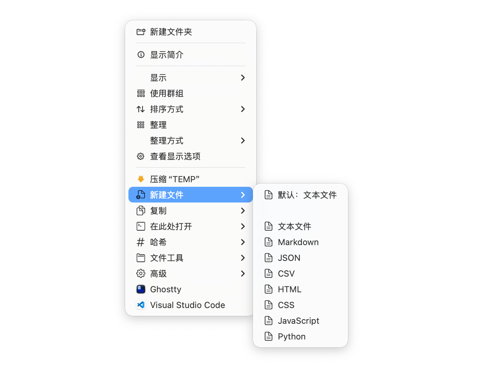
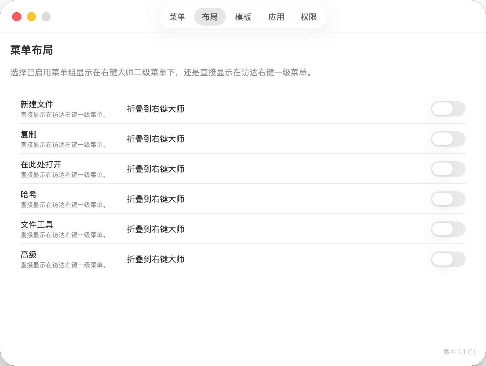
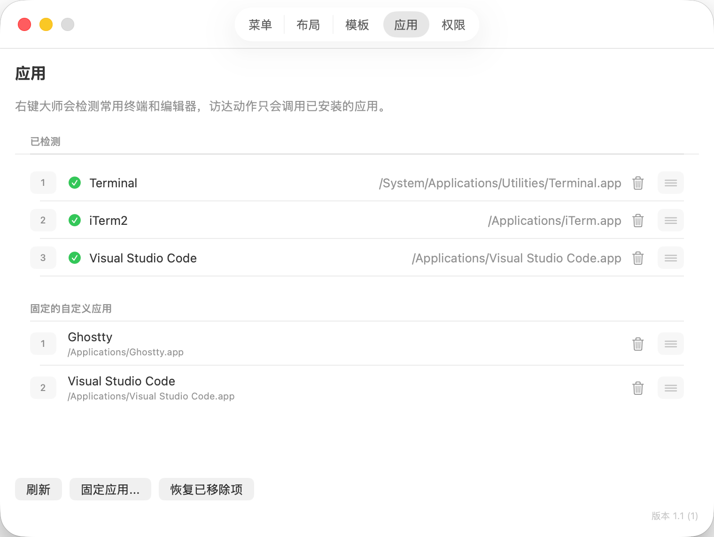

# ClickMate

[English README](README.md)

ClickMate, 中文名“右键大师”，是一个原生 macOS Finder 右键菜单增强工具。它基于 SwiftUI、AppKit 和 Finder Sync extension 构建，可以在 Finder 右键菜单中加入可配置的 `ClickMate` 子菜单，让常用文件和文件夹操作更顺手。







## 功能特性

- 支持选中文件、选中文件夹，以及已监控文件夹空白区域的 Finder 右键菜单。
- 新建文件模板：文本、Markdown、JSON、CSV、HTML、CSS、JavaScript、Swift、Python，以及自定义扩展名。
- 复制辅助：POSIX 路径、文件 URL、Shell 转义路径、文件名、基础文件名、扩展名、父级文件夹路径。
- 打开辅助：Terminal、iTerm2、VS Code、Cursor、BBEdit、Sublime Text，以及自定义固定应用。
- 哈希计算：SHA-256、SHA-1、MD5。
- 文件工具：显示父级文件夹、带时间戳复制、创建替身、移动到新文件夹、压缩。
- 高级工具：查看元数据、图片尺寸、切换隐藏文件显示。
- 设置界面：菜单布局、文件模板、应用检测、固定应用、监控文件夹。

## 环境要求

- macOS 14.0 或更高版本。
- Xcode 以及 macOS 开发工具。
- 本地无签名开发构建不强制要求 Apple Development team；如果要完整签名并分发 Finder extension，则需要配置开发团队和相关 entitlement。

## 构建

用 Xcode 打开项目：

```sh
open ClickMate.xcodeproj
```

也可以使用命令行构建：

```sh
xcodebuild build -project ClickMate.xcodeproj -scheme ClickMate -destination 'platform=macOS'
```

本地无签名验证时，可以显式关闭代码签名：

```sh
xcodebuild build -project ClickMate.xcodeproj -scheme ClickMate -destination 'platform=macOS' CODE_SIGNING_ALLOWED=NO
xcodebuild test -project ClickMate.xcodeproj -scheme ClickMate -destination 'platform=macOS' CODE_SIGNING_ALLOWED=NO
```

Debug 配置面向本地开发。Release 构建保留用于正式分发签名的 entitlement 文件。

## 本地运行

1. 在 Xcode 中打开 `ClickMate.xcodeproj`。
2. 选择 `ClickMate` scheme。
3. 如果需要完整可用的已签名 Finder extension，请为 app 和 Finder extension targets 设置 development team，并启用 App Group entitlement。
4. 运行 app。
5. 打开系统设置，在 Extensions 中启用 ClickMate Finder extension。
6. 如果菜单没有立即出现，可以重启 Finder：

```sh
killall Finder
```

然后在 Desktop、Documents、Downloads，或在 ClickMate 的 Permissions 页面添加的文件夹中右键测试。

## 在线更新

ClickMate 最多每 24 小时自动读取一次 GitHub 上最新的正式 Release，并将其 tag 与当前应用的 `CFBundleShortVersionString` 比较；比较时会忽略 tag 开头的 `v`。草稿和预发布版本不会作为常规更新提示，手动检查不受 24 小时间隔限制。

发现更高版本后，ClickMate 对同一版本只通知一次，并引导你前往可信的 GitHub Release 页面，由你手动下载并替换应用，不会静默下载或自动安装。自动检查失败时保持静默，手动检查会显示失败结果，但都不会影响当前已安装版本继续运行。

当前发布产物未进行 Developer ID 签名和公证。下载后，macOS Gatekeeper 可能要求用户明确授权后才能运行。

## 打包未签名 DMG

仓库提供了本地未签名 DMG 打包脚本：

```sh
Scripts/package_unsigned_dmg.sh
```

该 DMG 没有经过 Developer ID 签名，也没有 notarized。在其他机器上运行时，macOS Gatekeeper 可能会拦截应用；接收者需要明确信任该应用，或在复制到 `/Applications` 后移除 quarantine 属性。

## 在本地发布 GitHub Release

请先安装并登录 GitHub CLI，同时确保本机具备 `curl`、`jq` 和 Xcode 命令行工具。将 `ClickMate/Info.plist` 与 `ClickMateFinderExtension/Info.plist` 中的 `CFBundleShortVersionString` 更新为相同版本，并提交发布改动。

运行发布脚本前，需要自行创建并推送 release tag：

```sh
git tag -a v1.4 -m "Release v1.4"
git push origin v1.4
Scripts/release_github.sh v1.4
```

脚本也接受 `1.4`，并会规范化为 `v1.4`。脚本要求工作区干净，并依次检查两个 bundle 版本一致且匹配输入版本、本地 tag 与 `origin` tag 都指向 `HEAD`、目标 Release 尚不存在、目标版本严格高于 GitHub 最新正式 Release；随后运行无签名测试，调用 `Scripts/package_unsigned_dmg.sh` 构建 DMG，以只读方式挂载并验证主应用、Finder extension、版本号以及 `arm64` + `x86_64` 可执行文件，最后创建 GitHub Release 并上传 DMG。

`Scripts/release_github.sh` 不会创建、移动或推送 tag。上传的 DMG 仍未签名、未公证，发布用户同样会受到前述 Gatekeeper 限制。

## 贡献

欢迎贡献。请尽量保持改动聚焦，遵循项目现有 Swift 和 SwiftUI 风格；如果修改应用逻辑，请使用 `xcodebuild test` 验证相关行为。

## 许可证

ClickMate 使用 [MIT License](LICENSE) 开源。
